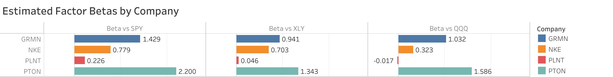
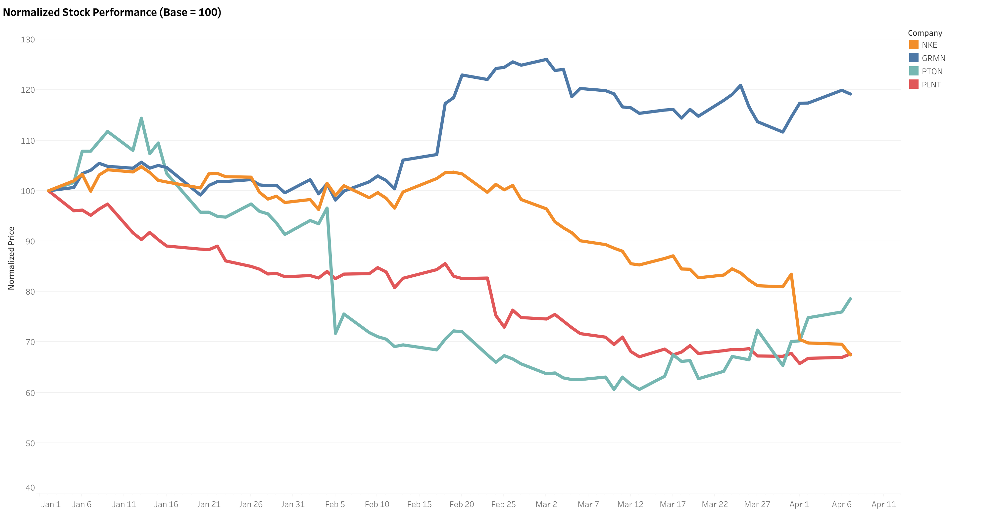

# Factor Exposures in Sports & Wellness Stocks

## Overview

This project explores how Nike, Garmin, Peloton, and Planet Fitness differ in their exposure to broad market, consumer discretionary, and growth-oriented factors. Using daily returns from January 1, 2026 through April 7, 2026, I built a short-horizon exploratory factor model in Python and paired it with Tableau visuals to compare estimated factor betas and normalized stock performance.

## Business Question

How do Nike, Garmin, Peloton, and Planet Fitness differ in their exposure to broad market, consumer discretionary, and growth-oriented factors?

## Why This Project

I’m especially interested in the intersection of sports, fitness, business, and analytics. These companies represent different parts of the consumer wellness landscape, from wearables and apparel to connected fitness and gym operations. Rather than treating them as one category, I wanted to explore whether their stock behavior reflects shared sector dynamics or meaningfully different business-model sensitivities.

## Tools Used

- Python
- pandas
- scikit-learn
- Tableau Public
- Excel (initial exploratory workflow)

## Method Summary

- Imported daily closing prices and standardized date formatting
- Calculated daily returns for each company and factor
- Used a series of simple linear regressions to estimate exposure to SPY, XLY, and QQQ individually
- Compared estimated betas across companies
- Rebased price series to 100 to compare relative performance over time

## Visual 1: Estimated Factor Betas by Company

## Visual 2: Normalized Stock Performance (Base = 100)

## Key Findings

- Nike and Garmin showed stronger broad-market sensitivity over this sample.
- Consumer discretionary exposure was meaningful across all four names.
- Relative performance diverged notably, suggesting these companies do not behave like a single unified segment.

## Limitations

- Short sample window
- Simple one-factor regression framework
- Exploratory analysis only; not an investment recommendation

## Next Steps

- Extend the sample window to 6–12 months
- Test a multi-factor regression model
- Add rolling beta analysis
- Compare against a custom sports and wellness basket